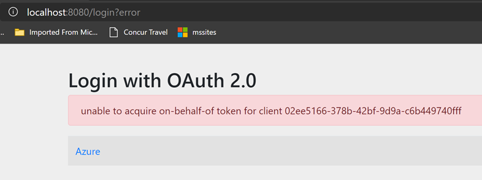
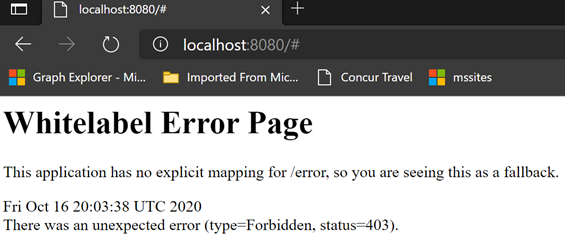

# Scenario: OIDC login to Spring MVC web app

This scenario is documented here: https://docs.microsoft.com/en-us/azure/developer/java/spring-framework/configure-spring-boot-starter-java-app-with-azure-active-directory#summary

## Feedback on docs

### Choice of flow

Implicit flow needs to be enabled for both id_token and access_token.  Best practices these days though is to work instead with either:

- a proper Authorization Code flow with secure backchannel, in which case the client secret is required
- an Authorization Code flow + PKCE which then can be executed from the browser and where client secret is not required, this is typically applicable for a mobile device scenario or in case of a SPA application

In this particular scenario example, the right choice seems to be first.  This is different from what the article recommends.

### Use of On-Behalf-Of

It looks like there's an On-Behalf-Of flow which gets executed:

The fact that the tutorial points out there's a need to give admin consent on `Directory.AccessAsUser.All` also allows the On-Behalf-Of flow to work.  Requiring admin consent for a normal user sign-in though is very heavy and would not be acceptable in many scenarios.

OBO should however NOT be required for this scenario.  OAuth 2 by itself is designed for delegated authorization, so if the app would just ask for permissions to access the directory, that by itself would be enough to do so on behalf of the user.  There's no need for OBO.

OBO is not needed and worse: it [can no longer be executed based on an id_token coming from an implicit flow](https://docs.microsoft.com/en-us/azure/active-directory/develop/v2-oauth2-on-behalf-of-flow) but requires an access token.  This causes the application to present me with the following error:

~~~txt
2020-10-16 20:00:16.508 ERROR 908 --- [nio-8080-exec-7] c.m.a.s.a.aad.AzureADGraphClient         : acquire on behalf of token for graph api error

java.util.concurrent.ExecutionException: com.microsoft.aad.msal4j.MsalServiceException: AADSTS240002: Input id_token cannot be used as 'urn:ietf:params:oauth:grant-type:jwt-bearer' grant.
~~~

### Use of groups

While the use of groups to make authorization decicions is not uncommon, we typically recomend customers to investigate AAD app roles instead.  This abstracts the application from being tied into certain group names.

I assume the OBO flow is used to access group-membership for the user.  This is however not required, group membership [can be configured part of the token](https://docs.microsoft.com/en-us/azure/active-directory/develop/active-directory-optional-claims#configuring-groups-optional-claims).  Need to take into account [groups overage claim](https://docs.microsoft.com/en-us/azure/active-directory/develop/id-tokens#groups-overage-claim) though.